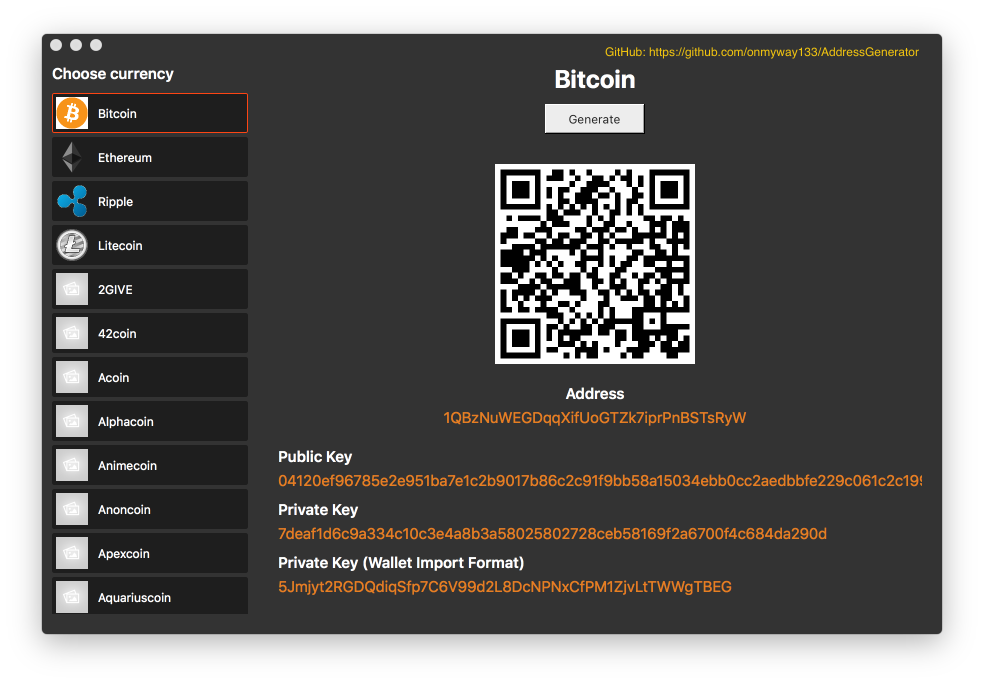

Address Generator
==

## Get started

### Asymetric cryptography

Would you give your money safe key to strangers? The same applies for cryptocurrencies, the money is truly yours when only you have the keys. If you know how troublesome it is to export private keys from online wallets, then you should generate your own key pair. `AddressGenerator` makes this easy.

A cryptocurrency account, which is based on [Asymetric cryptography](https://en.wikipedia.org/wiki/Public-key_cryptography), consists of 2 keys: public key and private key.

- The private key (raw or in [wallet import format](https://en.bitcoin.it/wiki/Wallet_import_format)) is a secret number generated randomly. You spend money by using private key to sign transaction
- The public key is derived from private key. Your account address is a hash value of this public key.

It's important that only you own and store these keys securely 💪

### Native

Generating wallets with Javascript browsers or `electron.js` apps is a big red flag ‼️  Those are built on top of hundreds of libraries. Even if you're offline, who know if any of those dependencies are doing evil 😱

You deserve a safer solution ♥️

`AddressGenerator` features

- Use pure Swift and C code. No extra dependencies.
- Support macOS 10.11
- Generate key pair using `OpenSSL`. On macOS 10.13, it is [LibreSSL](https://www.libressl.org/) 2.2.7 which is a fork of OpenSSL from 2014. OpenSSL seeds from `/dev/urandom`, which guarantee good entropy, so your keys are random and secure.
- No saving or networking. Your keys are generated and only you know about it.
- Fast
- Support many cryptocurrencies

## How to use

- Download latest release from https://github.com/onmyway133/AddressGenerator/releases

- Choose currency, then click "Generate"

## Supported currencies

Currently, we have

## Licence

This project is released under the MIT license. See LICENSE.md.
